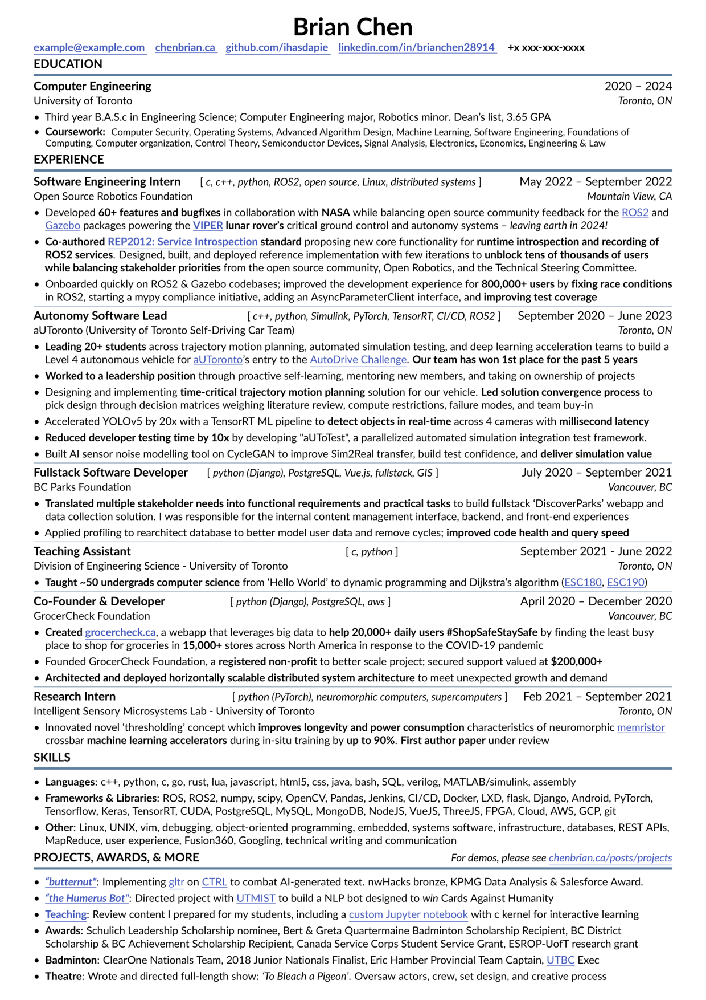

# resume
My resume template optimized [^1] for ATS systems, based on [altacv](https://github.com/liantze/AltaCV). 

See `pdftotext` output in `resume.txt` for a quick overview.


See [altacv](https://github.com/liantze/AltaCV) for more information.

Changes:
1. Cut down on icons to improve pdf-to-text conversion
2. Change to a single-column layout
3. `\itag{asdf}` command to draw an inline "tag"
4. `\chref` command for hyperlinks
5. Various changes to `\makecvevent`, etc. to improve pdf-to-text conversion

Example output:



Example pdftotext output:
```
Brian Chen
example@example.com chenbrian.ca github.com/ihasdapie linkedin.com/in/brianchen28914

+x xxx-xxx-xxxx

EDUCATION
2020 – 2024

Computer Engineering
University of Toronto

Toronto, ON

• Third year B.A.S.c in Engineering Science; Computer Engineering major, Robotics minor. Dean’s list, 3.65 GPA
• Coursework: Computer Security, Operating Systems, Advanced Algorithm Design, Machine Learning, Software Engineering, Foundations of
Computing, Computer organization, Control Theory, Semiconductor Devices, Signal Analysis, Electronics, Economics, Engineering & Law

EXPERIENCE
Software Engineering Intern

[ c, c++, python, ROS2, open source, Linux, distributed systems ]

Open Source Robotics Foundation

May 2022 – September 2022
Mountain View, CA

• Developed 60+ features and bugfixes in collaboration with NASA while balancing open source community feedback for the ROS2 and
Gazebo packages powering the VIPER lunar rover’s critical ground control and autonomy systems – leaving earth in 2024!
• Co-authored REP2012: Service Introspection standard proposing new core functionality for runtime introspection and recording of
ROS2 services. Designed, built, and deployed reference implementation with few iterations to unblock tens of thousands of users
while balancing stakeholder priorities from the open source community, Open Robotics, and the Technical Steering Committee.
• Onboarded quickly on ROS2 & Gazebo codebases; improved the development experience for 800,000+ users by fixing race conditions
in ROS2, starting a mypy compliance initiative, adding an AsyncParameterClient interface, and improving test coverage

Autonomy Software Lead
[ c++, python, Simulink, PyTorch, TensorRT, CI/CD, ROS2 ]
aUToronto (University of Toronto Self-Driving Car Team)

September 2020 – June 2023
Toronto, ON

• Leading 20+ students across trajectory motion planning, automated simulation testing, and deep learning acceleration teams to build a
Level 4 autonomous vehicle for aUToronto’s entry to the AutoDrive Challenge. Our team has won 1st place for the past 5 years
• Worked to a leadership position through proactive self-learning, mentoring new members, and taking on ownership of projects
• Designing and implementing time-critical trajectory motion planning solution for our vehicle. Led solution convergence process to
pick design through decision matrices weighing literature review, compute restrictions, failure modes, and team buy-in
• Accelerated YOLOv5 by 20x with a TensorRT ML pipeline to detect objects in real-time across 4 cameras with millisecond latency
• Reduced developer testing time by 10x by developing "aUToTest", a parallelized automated simulation integration test framework.
• Built AI sensor noise modelling tool on CycleGAN to improve Sim2Real transfer, build test confidence, and deliver simulation value

Fullstack Software Developer

July 2020 – September 2021

[ python (Django), PostgreSQL, Vue.js, fullstack, GIS ]

BC Parks Foundation

Vancouver, BC

• Translated multiple stakeholder needs into functional requirements and practical tasks to build fullstack ‘DiscoverParks’ webapp and
data collection solution. I was responsible for the internal content management interface, backend, and front-end experiences
• Applied profiling to rearchitect database to better model user data and remove cycles; improved code health and query speed

September 2021 - June 2022

[ c, python ]

Teaching Assistant
Division of Engineering Science - University of Toronto

Toronto, ON

• Taught ~50 undergrads computer science from ‘Hello World’ to dynamic programming and Dijkstra’s algorithm (ESC180, ESC190)

Co-Founder & Developer

April 2020 – December 2020

[ python (Django), PostgreSQL, aws ]

GrocerCheck Foundation

Vancouver, BC

• Created grocercheck.ca, a webapp that leverages big data to help 20,000+ daily users #ShopSafeStaySafe by finding the least busy
place to shop for groceries in 15,000+ stores across North America in response to the COVID-19 pandemic
• Founded GrocerCheck Foundation, a registered non-profit to better scale project; secured support valued at $200,000+
• Architected and deployed horizontally scalable distributed system architecture to meet unexpected growth and demand
[ python (PyTorch), neuromorphic computers, supercomputers ]
Intelligent Sensory Microsystems Lab - University of Toronto

Research Intern

Feb 2021 – September 2021
Toronto, ON

• Innovated novel ‘thresholding’ concept which improves longevity and power consumption characteristics of neuromorphic memristor
crossbar machine learning accelerators during in-situ training by up to 90%. First author paper under review

SKILLS
• Languages: c++, python, c, go, rust, lua, javascript, html5, css, java, bash, SQL, verilog, MATLAB/simulink, assembly
• Frameworks & Libraries: ROS, ROS2, numpy, scipy, OpenCV, Pandas, Jenkins, CI/CD, Docker, LXD, flask, Django, Android, PyTorch,
Tensorflow, Keras, TensorRT, CUDA, PostgreSQL, MySQL, MongoDB, NodeJS, VueJS, ThreeJS, FPGA, Cloud, AWS, GCP, git
• Other: Linux, UNIX, vim, debugging, object-oriented programming, embedded, systems software, infrastructure, databases, REST APIs,
MapReduce, user experience, Fusion360, Googling, technical writing and communication

PROJECTS, AWARDS, & MORE

For demos, please see chenbrian.ca/posts/projects

• “butternut": Implementing gltr on CTRL to combat AI-generated text. nwHacks bronze, KPMG Data Analysis & Salesforce Award.
• “the Humerus Bot": Directed project with UTMIST to build a NLP bot designed to win Cards Against Humanity
• Teaching: Review content I prepared for my students, including a custom Jupyter notebook with c kernel for interactive learning
• Awards: Schulich Leadership Scholarship nominee, Bert & Greta Quartermaine Badminton Scholarship Recipient, BC District
Scholarship & BC Achievement Scholarship Recipient, Canada Service Corps Student Service Grant, ESROP-UofT research grant
• Badminton: ClearOne Nationals Team, 2018 Junior Nationals Finalist, Eric Hamber Provincial Team Captain, UTBC Exec
• Theatre: Wrote and directed full-length show: ‘To Bleach a Pigeon’. Oversaw actors, crew, set design, and creative process


```


[^1]: Mostly by making sure `pdftotext` output looks the best it can be


